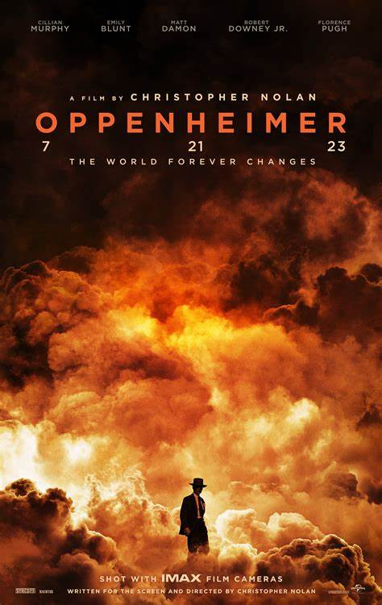

<h1 align="center"> Machine Learning Portfolio </h1>

Welcome!

This repository is portfolios that are related to machine learning / data science from  
<h3 align="center">Eduardo Imanuel Bastian </h3> 
I am an ITB (Bandung Institute of Technology) graduate in Aerospace Engineering that has deep passion in machine learning and data science.

There are three projects on this repository:

## 1. Baggage Jam Detection Using Computer Vision

To solve undetected baggage jam in airport baggage handling system, a baggage jam detection using computer vision is developed. The system is developed based on the real case in Yogyakarta International Airport, Indonesia (ICAO: WAHI). THe system is developed using TensorFlow Object Detection API by implementing transfer learning of SSD Mobilenet neural network model. 

## 2. Topic Modeling on Boeing Safety Reports Text Data

Analyzing a huge amount of text reports could be simplified using unsupervised learning. Latent topics within aviation safety reports could be discovered by implementing topic modeling. The Boeing data is gathered from the NASA ASRS database, and the narrative data is further analyzed. Using Latent Dirichlet Allocation (LDA), four topics can be modeled, and a Tableau dashboard is developed for presentation.

## 3. Sentiment Analysis on the *Oppenheimer* Movie

*Oppenheimer* movie is one of the biggest movies released in 2023 directed by famous filmmaker Christoper Nolan. By implementing sentiment analysis from IMDB reviews, one can understand how are the users' feedback on the movie.
